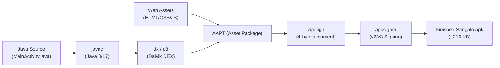

# 📱 The Pocket Developer Masterclass: How to Build & Compile Mobile Apps on Android (No Laptop Required)

> *"You don't need a $2,000 MacBook or 32GB RAM workstation to build production-grade software. Everything you need is already in your pocket."*

This guide documents the exact architecture and workflow used to engineer, compile, test, and release **सँगालो (Sangalo)**—a full-stack web companion and native Android APK (~216 KB)—**100% on a mid-range smartphone (Xiaomi Redmi Note 15 Pro 5G)** using Termux, an unprivileged Ubuntu Linux environment, and autonomous AI pair-programming.

Whether you don't own a laptop, or you want to connect a laptop/PC to your phone for a dual-screen experience, this guide walks you through every step.

> 🌟 **Looking for the dedicated open-source repository & community project?**  
> Check out [**The Pocket Developer (`pocket-developer`)**](https://github.com/dahalsandesh/pocket-developer) for standalone scripts, templates, homelab networking guides, and the 1-tap bootstrap installer.

---

## 📑 Table of Contents
1. [The Philosophy: Democratizing Software Creation](#1-the-philosophy-democratizing-software-creation)
2. [Phase 1: Setting Up the Phone-Only Workstation](#2-phase-1-setting-up-the-phone-only-workstation)
   - [Step 1: Install Termux Correctly](#step-1-install-termux-correctly)
   - [Step 2: Install Ubuntu PRoot (Linux on Android)](#step-2-install-ubuntu-proot-linux-on-android)
   - [Step 3: Install Core Development Tools](#step-3-install-core-development-tools)
   - [Step 4: AI Pair-Programmer Setup](#step-4-ai-pair-programmer-setup)
3. [Phase 2: The Local Development & Testing Loop](#3-phase-2-the-local-development--testing-loop)
   - [Running Local Web Servers](#running-local-web-servers)
   - [Live Testing in Mobile Chrome / Brave](#live-testing-in-mobile-chrome--brave)
4. [Phase 3: Building Native Android APKs Without Android Studio](#4-phase-3-building-native-android-apks-without-android-studio)
   - [Why Traditional Gradle Fails on Phones](#why-traditional-gradle-fails-on-phones)
   - [The Pure CLI Build Pipeline (`javac` + `dx` + `aapt` + `apksigner`)](#the-pure-cli-build-pipeline)
5. [Phase 4: Connecting a Laptop (Optional Enhancements)](#5-phase-4-connecting-a-laptop-optional-enhancements)
   - [Method A: Local Wi-Fi Browser Testing](#method-a-local-wi-fi-browser-testing)
   - [Method B: SSH Terminal Access](#method-b-ssh-terminal-access)
   - [Method C: VS Code Remote SSH (Full Desktop IDE on Phone Files)](#method-c-vs-code-remote-ssh)
6. [Phase 5: Git & GitHub Publishing from Mobile](#6-phase-5-git--github-publishing-from-mobile)
7. [Crucial Lessons & Troubleshooting](#7-crucial-lessons--troubleshooting)

---

## 1. The Philosophy: Democratizing Software Creation

Traditional mobile and web development is notoriously bloated:
- **Android Studio** requires 8GB–16GB RAM just for Gradle daemon caching.
- Emulators take minutes to boot and consume gigabytes of storage.
- Build tools frequently require fast, continuous broadband connections.

By contrast, modern smartphones (even budget/mid-range devices) feature powerful **64-bit octa-core ARM processors (ARM64 / aarch64)** and 6GB–12GB RAM. That is more computing power than the workstations that sent astronauts to the Moon or powered early Silicon Valley startups!

By running a lightweight native ARM64 Linux toolchain directly on the phone, development is:
- **Lightning fast:** Compilation happens in 5–10 seconds because there is zero Gradle overhead.
- **True-to-life:** You test directly on real mobile hardware (touch sensors, notifications, audio, vibration) without any emulator simulation mismatch.
- **100% Offline:** You can build, code, and test on a bus, during power outages, or in remote villages without internet.

---

## 2. Phase 1: Setting Up the Phone-Only Workstation

### Step 1: Install Termux Correctly
> [!WARNING]
> **DO NOT install Termux from the Google Play Store!** The Play Store version has been deprecated since 2020 due to Android SDK restrictions and cannot receive repository updates.

1. Download **Termux** from **[F-Droid](https://f-droid.org/packages/com.termux/)** or the **[GitHub Releases](https://github.com/termux/termux-app/releases)** page.
2. Open Termux and update the core package manager:
   ```bash
   pkg update && pkg upgrade -y
   ```
3. Grant storage permissions so Termux can read/write to your phone's internal storage (`/sdcard`):
   ```bash
   termux-setup-storage
   ```
   *(Tap "Allow" on the system permission popup).*

---

### Step 2: Install Ubuntu PRoot (Linux on Android)
Android’s native shell lacks a standard GNU C library (`glibc`) and package manager. We use **PRoot-Distro** to run a complete, sandboxed Ubuntu Linux distribution without requiring root permissions.

1. Install `proot-distro` in Termux:
   ```bash
   pkg install proot-distro -y
   ```
2. Install **Ubuntu**:
   ```bash
   proot-distro install ubuntu
   ```
3. Log into your Ubuntu environment:
   ```bash
   proot-distro login ubuntu
   ```
   *(You are now running Ubuntu Linux on your phone! Your prompt will change to `root@localhost:~#`).*

---

### Step 3: Install Core Development Tools
Inside your Ubuntu terminal, install Python, Java, Git, and build essentials:

```bash
apt update && apt upgrade -y
apt install -y \
  git \
  curl \
  wget \
  python3 \
  python3-pip \
  openjdk-17-jdk-headless \
  aapt \
  zipalign \
  apksigner \
  libandroid-tools-android-dev \
  tmux \
  nano
```

Create a dedicated workspace folder to keep your projects organized:
```bash
mkdir -p /root/workspace/apps
mkdir -p /root/workspace/tools
```

---

### Step 4: AI Pair-Programmer Setup
To pair-program without typing thousands of lines of syntax manually, you can run an AI coding agent directly inside your terminal:
- **Google Antigravity CLI (AGY):** If you have access to Google DeepMind's Antigravity CLI, install and authenticate it to drive development with Gemini 3.8 Flash.
- **Aider / Open-Source Coding Agents:** You can install CLI-based coding agents via Python:
  ```bash
  pip install aider-chat
  export GEMINI_API_KEY="your-api-key"
  aider --model gemini/gemini-2.0-flash
  ```
With this setup, you act as the **Product Architect**—describing screens, business logic, calendar math, and bug fixes in conversational English or Nepali—while the AI agent generates, tests, and edits the code directly in your workspace.

---

## 3. Phase 2: The Local Development & Testing Loop

### Running Local Web Servers
Inside your project directory (e.g. `/root/workspace/apps/sangalo`), you can launch a local HTTP server:

```bash
# Using Python's built-in threaded server
python3 server.py
# Or standard Python one-liner bound to all interfaces
python3 -m http.server 8090 --bind 0.0.0.0
```

### Live Testing in Mobile Chrome / Brave
Because the server is running natively on your phone:
1. Open Chrome or Brave on the same phone.
2. Navigate to:
   ```text
   http://localhost:8090
   ```
3. **PWA Standalone Mode:** In browser settings, tap **"Add to Home screen"** or **"Install app"**. It will now appear on your launcher with a custom icon, splash screen, and full offline caching!

---

## 4. Phase 3: Building Native Android APKs Without Android Studio

### Why Traditional Gradle Fails on Phones
If you try to run standard `gradle assembleRelease` on a smartphone:
- Gradle attempts to download hundreds of megabytes of JVM plugins.
- Android Studio daemons easily exceed 4GB–6GB of RAM, triggering the Android OS low-memory killer (OOM).
- Builds take 10–20 minutes and often crash mid-way.

### The Pure CLI Build Pipeline
Sangalo uses a **pure lightweight toolchain** running directly on ARM64 Linux that compiles an entire production APK in **~10 seconds**:



#### The 5-Step Pipeline:
1. **Compile Android Resources (`aapt`):**
   ```bash
   aapt package -f -m -J .build/gen -S res -M AndroidManifest.xml -I .android_sdk/android.jar
   ```
2. **Compile Java (`javac`):**
   ```bash
   javac -source 8 -target 8 -cp .android_sdk/android.jar -d .build/obj $(find .build/src -name "*.java")
   ```
3. **Convert Bytecode to Dalvik Executable (`dx` or `d8`):**
   ```bash
   dx --dex --output=.build/classes.dex .build/obj
   ```
4. **Package Assets & Classes into Unsigned APK (`aapt`):**
   ```bash
   aapt package -f -M AndroidManifest.xml -S res -A public -I .android_sdk/android.jar -F .build/unsigned.apk
   cd .build && aapt add unsigned.apk classes.dex
   ```
5. **Align & Cryptographically Sign (`zipalign` + `apksigner`):**
   ```bash
   zipalign -f 4 .build/unsigned.apk .build/aligned.apk
   apksigner sign --ks release.keystore --ks-pass pass:android --out /sdcard/Documents/Projects/Sangalo.apk .build/aligned.apk
   ```

*The result:* A signed, verified, ~216 KB APK generated in seconds directly onto your phone's storage ready to tap and install!

---

## 5. Phase 4: Connecting a Laptop (Optional Enhancements)

If you have access to a laptop or desktop and want a bigger keyboard, mouse, or dual-monitor view, you can connect your computer to your phone without changing the backend.

### Method A: Local Wi-Fi Browser Testing
1. Find your phone's Wi-Fi IP address in Termux:
   ```bash
   ifconfig | grep "inet "
   # Example: 192.168.1.15
   ```
2. Ensure your phone server is bound to `0.0.0.0:8090`.
3. On your laptop browser (connected to the same Wi-Fi), open:
   ```text
   http://192.168.1.15:8090
   ```
   You can now test the web interface on your laptop monitor in real-time.

---

### Method B: SSH Terminal Access
Control your phone's Linux terminal from your laptop:
1. In Termux (outside PRoot), install OpenSSH:
   ```bash
   pkg install openssh -y
   ```
2. Set a password:
   ```bash
   passwd
   ```
3. Start the SSH daemon:
   ```bash
   sshd
   ```
4. On your laptop terminal, connect to your phone:
   ```bash
   ssh -p 8022 <phone-ip>
   # Example: ssh -p 8022 192.168.1.15
   ```
   *(Termux SSH runs on port `8022` by default).*

---

### Method C: VS Code Remote SSH (Full Desktop IDE on Phone Files)
You can use the official **VS Code** on your laptop as a graphical editor while all code runs on your phone:
1. Open VS Code on your laptop.
2. Install the **Remote - SSH** extension.
3. Add a new SSH host:
   ```text
   ssh -p 8022 <phone-ip>
   ```
4. Connect to the host and open `/data/data/com.termux/files/home`.
5. You now have full desktop syntax highlighting, terminal splits, git diffing, and file trees running directly against your phone's filesystem!

---

## 6. Phase 5: Git & GitHub Publishing from Mobile

You don't need a browser to manage GitHub:
1. Install GitHub CLI inside Ubuntu:
   ```bash
   apt install -y gh
   ```
2. Authenticate securely using the web device flow:
   ```bash
   gh auth login
   ```
   - Select **GitHub.com** → **HTTPS** → **Yes** → **Login with a web browser**.
   - Copy the one-time code and tap the link to authorize in your mobile browser.
3. Configure Git to link commits to your profile:
   ```bash
   git config --global user.name "Your Name"
   git config --global user.email "your-github-email@example.com"
   gh auth setup-git
   ```
4. Create a public repository and push:
   ```bash
   gh repo create my-app --public --source=. --remote=origin --push
   ```
5. Publish a direct downloadable APK release:
   ```bash
   gh release create v1.0.0 /sdcard/Documents/Projects/Sangalo.apk \
     --title "Sangalo v1.0.0 Release" \
     --notes "Initial offline release"
   ```

---

## 7. Crucial Lessons & Troubleshooting

### 1. Always Build on `ext4`, Never on `/sdcard`
- **Rule:** Keep your source code, `node_modules`, `.git`, and build folders inside `/root/workspace/` (the internal Linux ext4 filesystem).
- **Why:** Android's internal storage (`/sdcard`) uses the FUSE/sdcardfs filesystem, which lacks proper Linux file permission bits, symlink capabilities, and executable flags (`chmod +x` does not work).
- **Workflow:** Build your APK inside the container, then copy the finished `.apk` file to `/sdcard/Documents/Projects/` for easy installation.

### 2. Disable Aggressive Battery Optimization
Android vendors (Xiaomi HyperOS, Samsung OneUI, OnePlus OxygenOS) aggressively kill background processes to save battery:
- Go to phone **Settings → Apps → Termux**.
- Set Battery Saver to **"No restrictions"**.
- Lock Termux in your recent apps drawer.

### 3. Use `tmux` for Session Resilience
If Android temporarily pauses Termux while you switch apps, a running task might terminate. Use `tmux` to ensure persistent sessions:
```bash
# Start a persistent session
tmux new -s dev

# If disconnected, reattach anytime
tmux attach -t dev
```

---

## 🎯 Summary: The Power Is Yours

Building software is no longer reserved for those with expensive hardware. With:
- A $150–$250 smartphone
- Free open-source tools (Termux, PRoot, Ubuntu, OpenJDK)
- Conversational AI pair programming

You have an entire software studio in the palm of your hand. Build something amazing! 🇳🇵🚀
